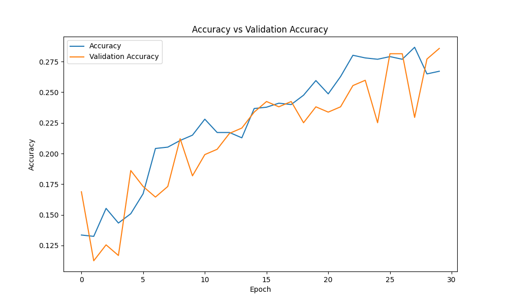
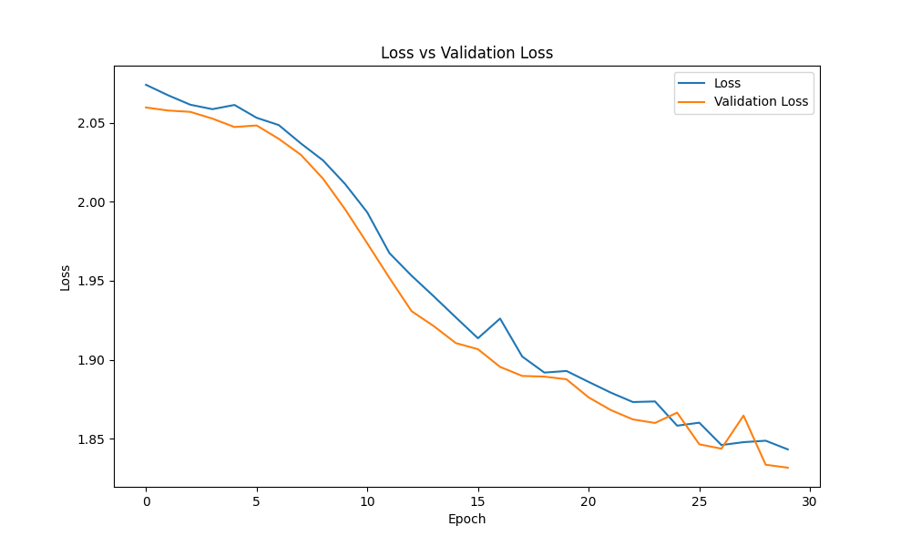
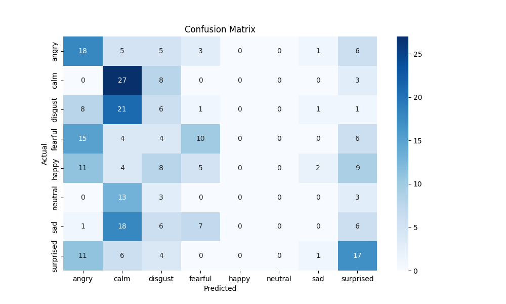
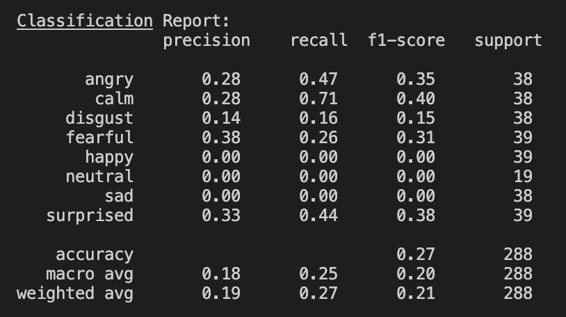
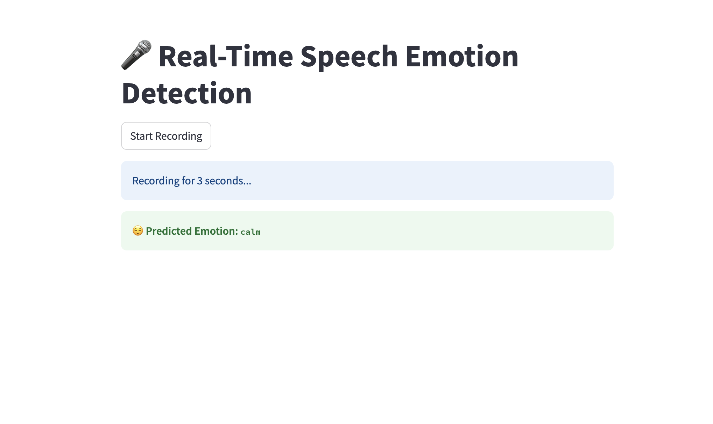

# Real-Time Speech Emotion Detection System

A real-time deep learning system that predicts human emotion from voice using MFCC feature extraction and a TensorFlow-based neural network. Built with `librosa`, `TensorFlow`, and `Streamlit`, the app captures audio via microphone and classifies it into emotions like happy, sad, angry, calm, etc.

<p align="center">
  
  
  
  
</p>

---

## Overview

- Uses MFCC (Mel Frequency Cepstral Coefficients) for feature extraction from speech.
- Trains a neural network to classify emotions from the RAVDESS dataset.
- Performs live inference from mic input.
- Shows performance metrics like confusion matrix, accuracy, and loss plots.
- Deployable with Streamlit UI for live demos.

---

## Dataset

- **Source**: [RAVDESS Emotional Speech Audio Dataset](https://www.kaggle.com/datasets/uwrfkaggler/ravdess-emotional-speech-audio)
- 24 actors recorded 8 emotion types:
  - `neutral`, `calm`, `happy`, `sad`, `angry`, `fearful`, `disgust`, `surprised`

---

## Preprocessing & Features

- Audio is loaded using `librosa`
- MFCCs (40 coefficients) extracted and averaged per file
- Labels are parsed from RAVDESS filenames and encoded for model training

---

## Model Architecture

- Input: 40 MFCCs
- Dense(128, relu) + Dropout(0.3)
- Dense(64, relu)
- Output: Dense layer with softmax (8 classes)
- Optimizer: Adam
- Loss: Sparse categorical cross-entropy

---

## Training & Evaluation

<p align="center">
  
  
</p>

<p align="center">
  
  
</p>

---

## Live Emotion Detection App

Built with [Streamlit](https://speech-emotion-detector.streamlit.app/) — this app:
- Records 3 seconds of live audio
- Extracts MFCC features
- Predicts emotion using the trained model
- Displays prediction with emoji and styling

<p align="center">
  
</p>

---

## Project Structure
```python
speech-emotion-detector/ 
├── app/ # Streamlit app 
│ └── app.py 
├── src/ # Training & inference scripts 
│ ├── data_preprocessing.py 
│ ├── train_model.py 
│ ├── live_predict.py 
│ ├── emotion_model.h5 
│ └── label_encoder.pkl 
├── data/ # RAVDESS dataset + processed CSV 
│ └── emotion_features.csv 
├── graphs/ # Confusion matrix, accuracy/loss graphs 
├── requirements.txt 
├── README.md 
└── .gitignore

```

---

## Getting Started

### 1. Clone the Repo
```bash
git clone https://github.com/rajkumar160798/speech-emotion-detector.git
cd speech-emotion-detector
```

### 2. Install Dependencies
```bash
pip install -r requirements.txt
```

### 3.Train the Model
```bash
python3 src/data_preprocessing.py
python3 src/train_model.py
```

### 4.Test Live Prediction (Terminal)
```bash
python3 src/live_predict.py
```

### 5.Launch Streamlit App
```bash
streamlit run app/app.py
```

## Future Enhancements
- Use spectrograms + CNN for improved accuracy
- Explore LSTM or Transformer models for temporal dependencies
- Add support for longer recording + live waveform visualization
- Deploy to Streamlit Cloud or Hugging Face Spaces

## License
This project is licensed under the MIT License.

## Acknowledgements
- Librosa for audio feature extraction
- TensorFlow for deep learning
- Streamlit for UI
- RAVDESS Dataset

## 👨‍💻 Author
**Raj Kumar Myakala**  
AI | Data | Automation | GCP | Python  
[LinkedIn ](https://www.linkedin.com/in/raj-kumar-myakala-927860264/)  
[GitHub ](https://github.com/rajkumar160798)

---

>  If you like this project, consider starring the repo and following my GitHub for more AI/ML innovations!

